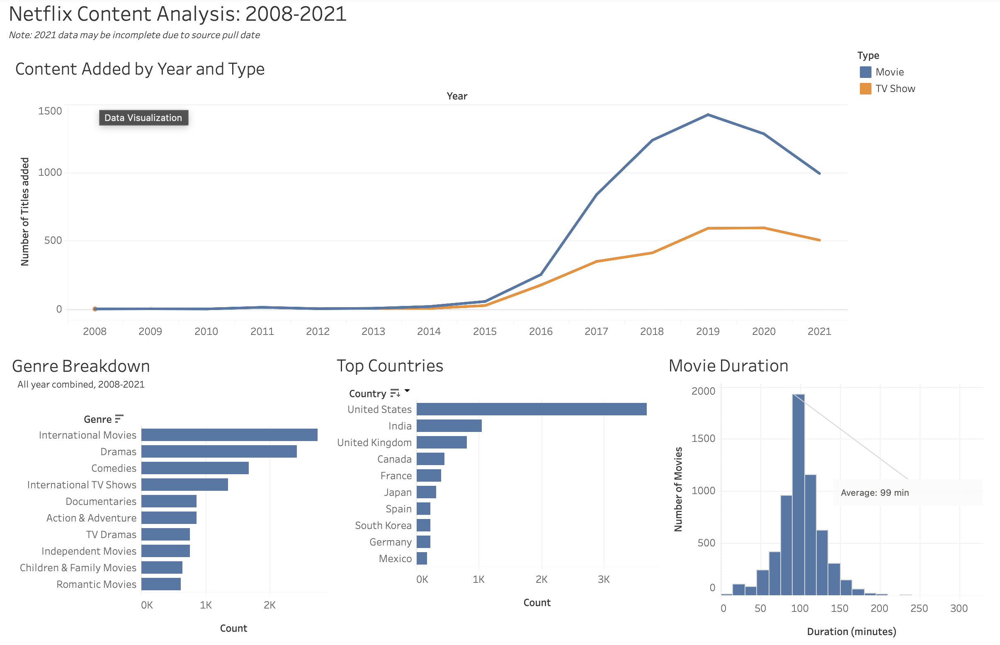

# Netflix Content Analysis

An end-to-end data analysis project exploring Netflix's content catalog (2008–2021) using Python, SQL, and Tableau. This project covers the full pipeline: raw data cleaning, exploratory analysis, SQL querying, and interactive dashboard visualization.

**[View the live Tableau dashboard →](your-tableau-public-link-here)**



## Overview

This project analyzes ~8,800 Netflix titles to answer four core questions:

1. **How has Netflix's content library grown over time, and how does the Movie/TV Show split compare?**
2. **What genres dominate the catalog, and how has that mix shifted year to year?**
3. **What's the typical movie runtime, and how is duration distributed?**
4. **Which countries produce the most content on the platform?**

## Dataset

Source: [Netflix Movies and TV Shows](https://www.kaggle.com/datasets/shivamb/netflix-shows) (Kaggle), containing ~8,800 titles with metadata including type, genre, cast, country, date added, and duration.

## Tech Stack

- **Python** (pandas) — data cleaning and exploration
- **SQLite** — relational querying
- **Tableau Public** — interactive dashboard
- **Jupyter Notebook** — analysis documentation

## Project Structure

```
netflix-portfolio-project/
├── data/
│   ├── raw/
│   │   └── netflix_titles.csv          # Original Kaggle dataset
│   └── processed/
│       └── netflix.db                  # SQLite database (derived, gitignored)
├── notebooks/
│   └── 01_clean_explore.ipynb          # Full pandas cleaning + exploration workflow
├── sql/
│   └── queries.sql                     # SQL versions of the core analysis questions
├── outputs/
│   ├── netflix_titles_cleaned.csv      # Full cleaned dataset
│   ├── titles_by_year_and_type.csv     # Q1 summary
│   ├── genre_trend_by_year.csv         # Q2 summary
│   └── top_countries.csv               # Q4 summary
├── requirements.txt
└── README.md
```

## Process

**Step 1 — Load:** Imported the raw Kaggle CSV into pandas.

**Step 2 — Clean:** Handled missing values (director, cast, country marked "Unknown"), split `duration` into `duration_value` and `duration_unit`, parsed `date_added` into proper datetime and extracted `year_added`.

**Step 3 — Explore:** Investigated distributions across type, rating, genre, and country using pandas.

**Step 4 — Explore with Pandas:** Built genre- and country-exploded views (`df_by_genre`, `df_by_country`) to correctly handle titles with multiple genres/countries, then answered all four core questions directly in pandas.

**Step 5 — Same Questions in SQL:** Loaded the cleaned data into a local SQLite database and re-answered the same four questions using SQL, as a cross-check and to demonstrate SQL proficiency alongside pandas.

**Step 6 — Export:** Exported the cleaned dataset and three aggregated summary tables to CSV, ready for Tableau.

**Step 7 — Tableau Dashboard:** Built a four-panel interactive dashboard in Tableau Public covering all four questions.

## Key Findings

- Netflix's content additions grew sharply from 2015–2019, peaking in 2019 (~1,500 movies added that year alone), before declining in 2020–2021 (2021 data may be incomplete due to source pull date).
- **International Movies** (2,752), **Dramas** (2,427), and **Comedies** (1,674) are the most common genres across the catalog.
- The average movie runtime is **99.6 minutes** (median: 98), with the middle 50% of movies falling between 87–114 minutes.
- The **United States** dominates content origin (3,689 titles), followed by **India** (1,046) and the **United Kingdom** (804).

## How to Run

```bash
# Clone the repo
git clone <your-repo-url>
cd netflix-portfolio-project

# Set up environment
python -m venv venv
source venv/bin/activate  # Windows: venv\Scripts\activate
pip install -r requirements.txt

# Launch the notebook
jupyter notebook notebooks/01_clean_explore.ipynb
```

## Author

Gianmarco Iparraguirre — [https://www.linkedin.com/in/gianmarcoiparraguirre/] · [https://github.com/giparraguirre]